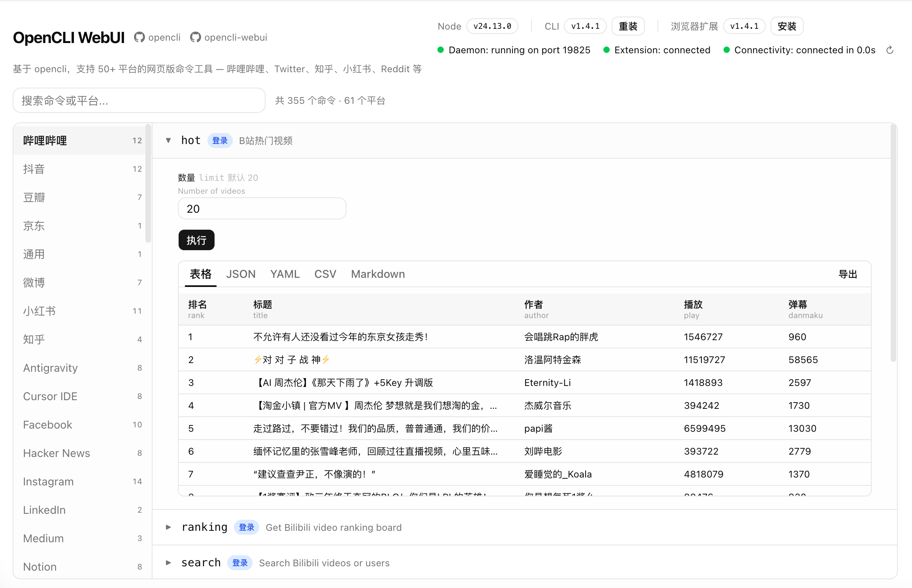
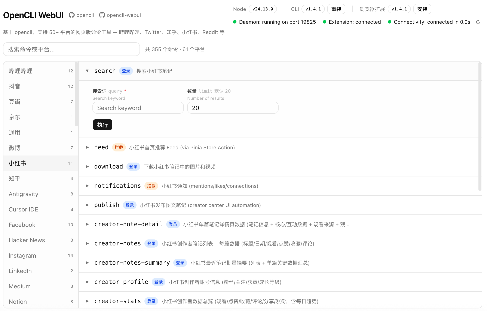

# OpenCLI WebUI

基于 [opencli](https://github.com/jackwener/opencli) 的网页版命令工具，无需终端，打开浏览器即可使用 50+ 平台的数据抓取能力。

支持平台包括：哔哩哔哩、Twitter、知乎、小红书、Reddit、GitHub、YouTube 等。

## 截图





## 功能

- **命令浏览**：按平台分类展示所有可用命令，支持搜索
- **在线执行**：填写参数后直接在页面执行命令，实时流式输出结果
- **多格式导出**：支持表格、JSON、YAML、CSV、Markdown 格式查看与下载
- **版本管理**：检测 Node.js、opencli CLI 版本，支持一键安装/更新
- **诊断面板**：运行 `opencli doctor` 实时展示环境诊断结果
- **远端浏览器扩展**：WebUI/CLI 跑在 Linux 服务器，用户本机只安装 Chrome 插件即可连接本机浏览器 Profile

## 快速开始

确保服务器已安装 [Node.js](https://nodejs.org) v21 及以上版本。

```bash
# 安装依赖
pnpm install

# 开发模式
pnpm dev

# 生产构建
pnpm build && pnpm start
```

默认运行在 [http://localhost:3002](http://localhost:3002)。

`@jackwener/opencli` 已作为项目依赖安装。若需要全局 CLI，也可以手动安装：

```bash
npm install -g @jackwener/opencli
```

## 远端浏览器插件模式

本项目内置 OpenCLI Remote Bridge。Linux 服务器启动 WebUI 后，会同时启动一个本机 opencli 兼容 daemon：

```text
opencli 命令 -> 服务器 127.0.0.1:19825 -> WebUI Remote Bridge -> 用户 Chrome 插件 -> 用户本机浏览器
```

用户 Windows/Mac 本机不需要安装 opencli，只需要：

1. 打开 WebUI 顶部「远端浏览器插件」安装弹窗。
2. 下载 `opencli-remote-extension.zip` 并解压。
3. 在 Chrome `chrome://extensions` 开启开发者模式，加载解压后的插件目录。
4. 打开插件弹窗，填写 WebUI URL。
5. 如果服务器设置了 `OPENCLI_BRIDGE_TOKEN`，在插件里填写同一个 Token。

生产部署建议设置 Token：

```bash
OPENCLI_BRIDGE_TOKEN='change-me' pnpm start
```

如需避开服务器上已有的 `19825` 端口：

```bash
OPENCLI_REMOTE_DAEMON_PORT=19826 pnpm start
```

## 技术栈

- Next.js 16 (App Router) + TypeScript
- Tailwind CSS + shadcn/ui
- TanStack Query
- SSE 实时流式输出

## 相关链接

- [opencli](https://github.com/jackwener/opencli) — 命令行工具本体
- [opencli-webui](https://github.com/xjh1994/opencli-webui) — 本项目
